# 🧠 Agentic AI Workshop – Customer Support Agent

## 🎯 Goal of the workshop
Learn how to build a powerful, intelligent customer support agent using **DataStax Langflow**. You’ll start by creating a simple chatbot with **watsonx.ai** (IBM's generative AI platform), then enrich it with retrieval-augmented generation (RAG) by connecting it to your own FAQ knowledge base using **DataStax Astra DB**. Finally, you’ll add tools such as order lookups, product info access, calculators, and web tools to make your agent truly agentic—capable of reasoning, taking actions, and handling real-world customer support scenarios.

By the end of this workshop, you’ll have a fully functional AI agent that can:
- Answer FAQs (unstructured documents) using vector-based document search
- Retrieve live order and product details from structured data
- Combine tools (like calculators and lookups) to generate multi-step responses
- Adapt dynamically to user intent—just like a real support agent would

## 🛠️ Prerequisites
This workshop assumes you have access to:
1. [A Github account](https://github.com)

During the course, you'll gain access to the following by signing up for free:
1. [DataStax Astra DB](https://astra.datastax.com) (you can sign up through your **public** Github account)
2. [IBM watsonx.ai](https://www.ibm.com/products/watsonx-ai) (you can sign up for a free trial)
3. [DataStax Langflow](https://langflow.org) access

Follow the below steps and note down the **Astra DB API Endpoint**, **Astra DB ApplicationToken**, **watsonx.ai Project ID**, **watsonx.ai API Key** and **watsonx.ai URL** as we'll need them later on.

### Sign up for DataStax Astra DB
Make sure you have a vector-capable Astra database (get one for free at [astra.datastax.com](https://astra.datastax.com))
- Sign up or log in
- Click `Databases` and click `Create Database` 
- Select `Serverless (Vector)`, type a database name, i.e. `support_agent` and select `AWS` as Cloud Provider and `us-east-2` as Region
    - ⚠️ Please stick to these settings as that enables us to use the [Astra Vectorize](https://www.datastax.com/blog/simplifying-vector-embedding-generation-with-astra-vectorize) functionality
- Wait a few minutes for it to provision
- Note down the **API Endpoint** which can be found in the right pane underneath *Database details*.
- Click on `Generate Token` and give it a name, i.e. `support_agent-token` and click `Generate`. Now click on the copy button and paste the **Application Token** somewhere for later use

    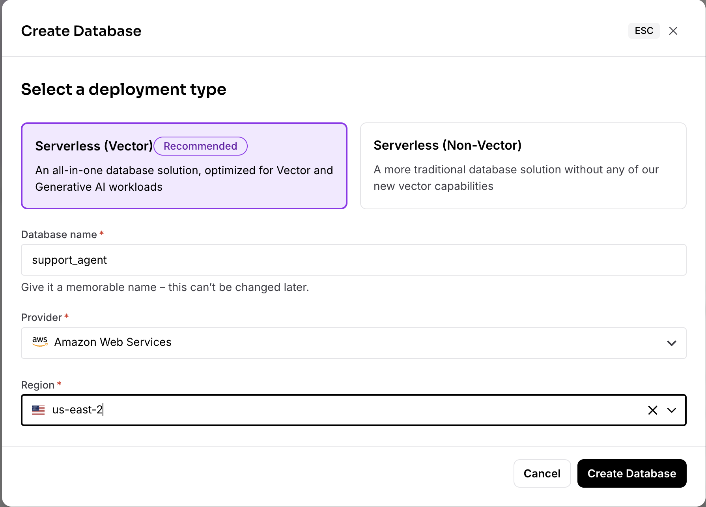

### Sign up for IBM watsonx.ai
- Go to [IBM watsonx.ai](https://www.ibm.com/products/watsonx-ai) and sign up for a free trial or log in.
- Once logged in, create a new project (or use an existing one).
- Navigate to the API Keys section (Administration → Access (IAM) → API keys) and create a new **API key**. Save this key securely.
- Note your **Project ID** (found in your watsonx.ai project details).
- You will also need the **watsonx.ai URL** (typically `https://eu-de.ml.cloud.ibm.com` or as shown in your project dashboard).
- For more details, see the [watsonx.ai documentation](https://dataplatform.cloud.ibm.com/docs/content/wsj/analyze-data/ml-authentication.html?context=wx).

    *(Optional: If you need a service instance, create a new instance of "watsonx.ai" in the IBM Cloud console and bind it to your project.)*

    *(You may also need to enable the appropriate LLM model in your project, such as `ibm/granite-3-3-8b-instruct` or similar.)*

### Get access to Langflow
There are several way to gain access to Langflow. Pick the one that suits you best 😊:
- [Langflow desktop](https://www.langflow.org/desktop) (currently only for Mac)
- [Managed Langflow on Astra](https://astra.datastax.com/langflow)
- (easiest 🤩) Just follow the instructions and use Github Codespaces in this tuturial

### ⚡️ Open this tutorial on Github Codespaces
To make life easier, we'll use the awesome Github Codespace functionality. Github offers you a completely integrated developer experience and resources to get started quickly. How?

1. Open the [watsonx-langflow-agent](https://github.com/michelderu/watsonx-langflow-agent) repository
2. Click on `Use this template`->`Ceate new repository` as follows:

    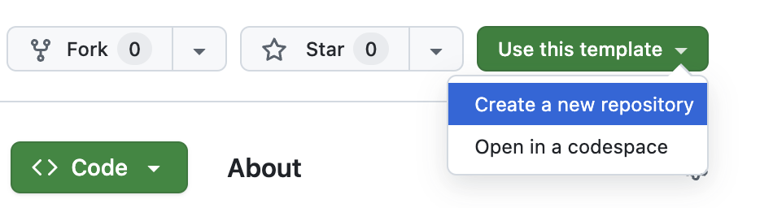

3. Now select **your** github account and name the new repository (any name or just use `watsonx-langflow-agent`). Ideally also set the description. Click `Create repository`

    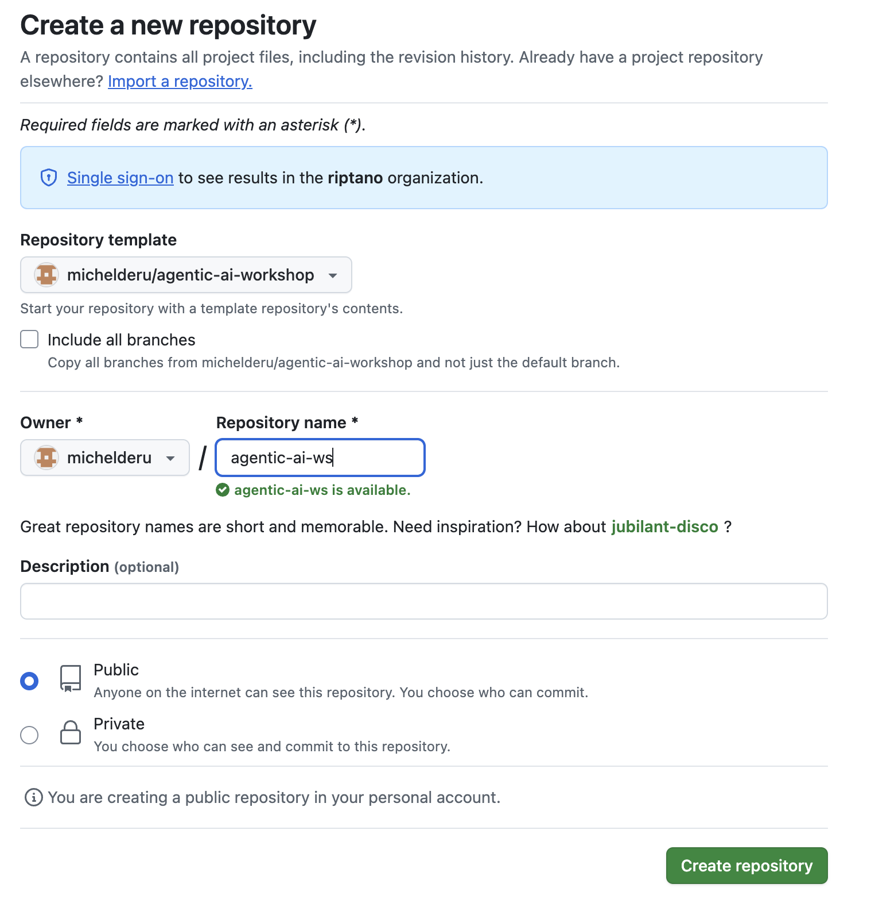

4. Cool! You just created a copy in your own Gihub account! Now let's get started with coding. Click `Create codespace on main` as follows:

    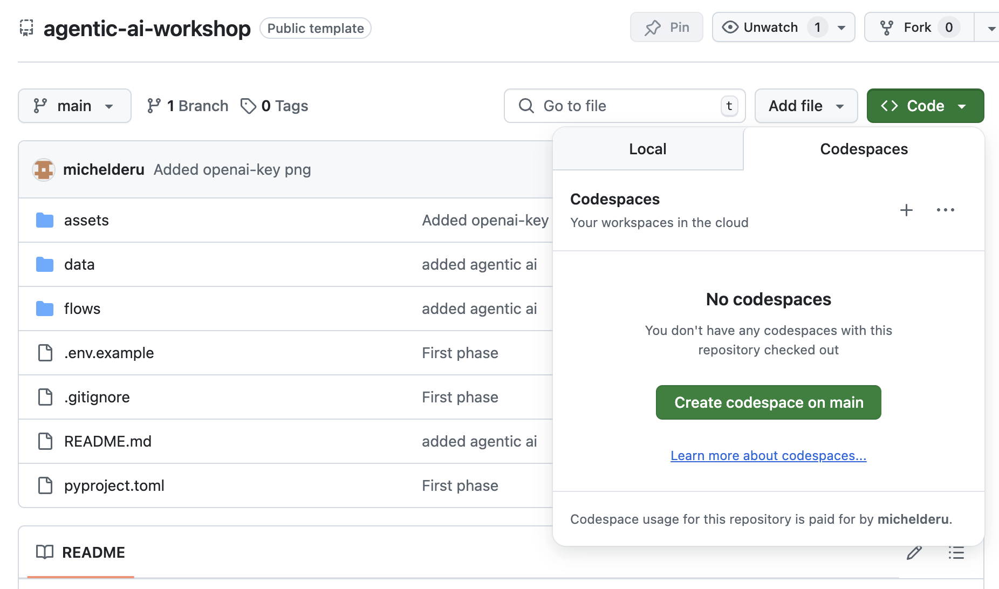

5. Configure the secrets as follows:

- Copy `.env.example` to `.env`
- Edit `.env` and provide the required variables:
    - `WATSONX_PROJECT_ID` (your watsonx.ai project ID)
    - `WATSONX_API_ENDPOINT` (your watsonx.ai endpoint, e.g. `https://us-south.ml.cloud.ibm.com`)
    - `WATSONX_API_KEY` (your watsonx.ai API key)
    - `ASTRA_DB_API_ENDPOINT` and `ASTRA_DB_APPLICATION_TOKEN`

    Example `.env`:
    ```env
    WATSONX_PROJECT_ID=your-watsonx-project-id
    WATSONX_API_ENDPOINT=https://eu-de.ml.cloud.ibm.com
    WATSONX_API_KEY=your-watsonx-api-key
    ASTRA_DB_API_ENDPOINT=your-astra-endpoint
    ASTRA_DB_APPLICATION_TOKEN=your-astra-token
    ```

    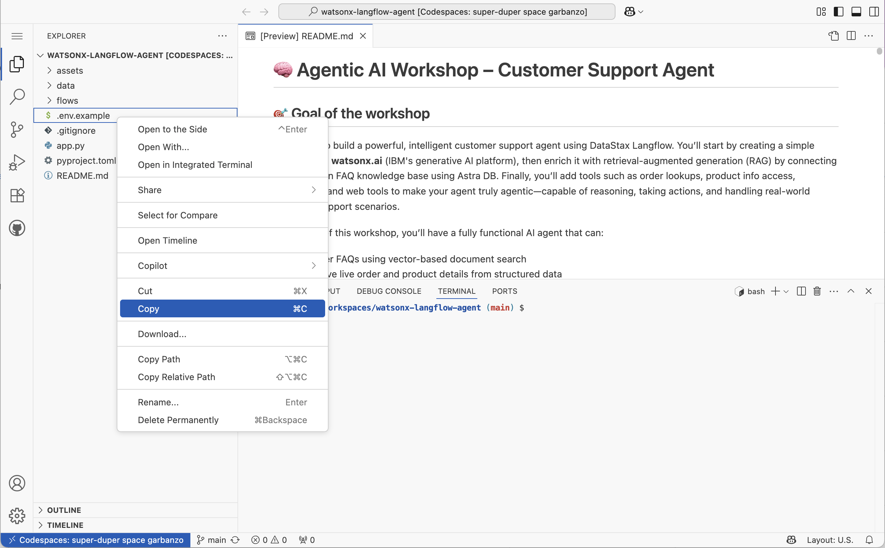

6. Now we can run Langflow as follows in the terminal window:

    ```bash
    pip install uv
    uv sync
    uv run langflow run --env-file .env
    ```

    This starts Langflow and opens a port to your Codespace in the cloud. In case you lose track of the URL to Langflow, just click on `PORTS` in the terminal window.

🎉 Congrats! You finished the set-up part of the workshop. Now for the fun part!

## 📦 Workshop follow-along

### 1. 🧱 Setup of a simple Langflow Chatbot
**Goal:** Create a chatbot with: input → model → output

#### Steps:
1. Open Langflow
2. Click `+ New Flow` / `+ Blank Flow`
3. Collapse `Inputs` and drag the `Chat Input` component to the canvas
4. Collapse `Models` and drag the `IBM watsonx.ai` component to the canvas. Connect `Input` to the `Chat Input`
    - Ensure that the `API Endpoint`, `Project ID` and `API Key` have been set correctly
    - Select `ibm/granite-3-3-8b-instruct` as the `model`  (or try another one and check out the differences)
5. Collapse `Outputs` and drag the `Chat Output` component to the canvas. Connect `Message` to the `Chat Output` component

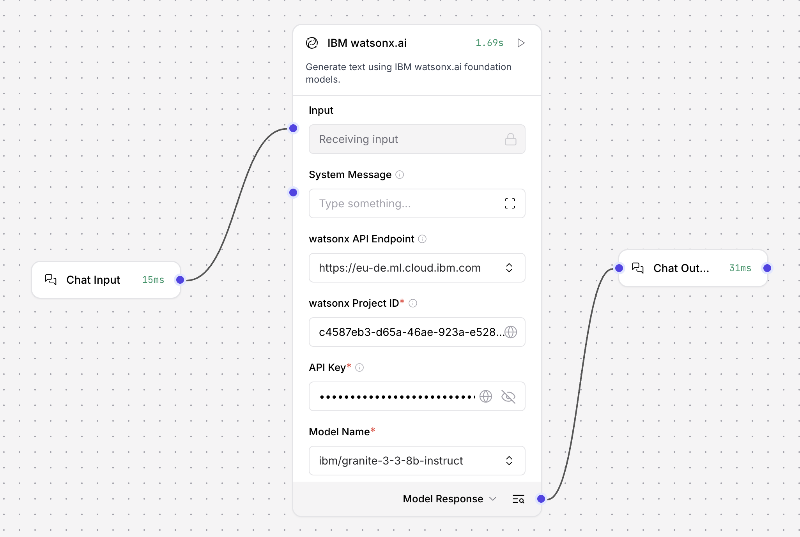

👏 Amazing! You just built your first flow. Let's run it by clicking `▶️ Playground` and asking the question:

    What's the difference between AI and Machine Learning?

You'll see **watsonx.ai** answer your question nicely!

### 2. 🧭 Familiarize yourself with Langflow
**Goal:** Understand the main components of Langflow

#### Steps:
1. If still open, close the Playground popup
2. Select `Chat Input` and click `Controls`
3. You'll see a field name `Input Text`, type `What's the difference between AI and Machine Learning` in the text field. close the popup
4. Select `Chat Output`, the three dots `...` and click `Expand`
5. Do the same with `Chat Input`
6. Click the play button `▶️` on the `Chat Output` component and see the flow run

Notice the running time of the separate components.  
Click the magnifying glass `🔍` in the `watsonx.ai` component. This shows you a popup with the intermediate data that is passed to the next component. Very useful for debugging purposes!

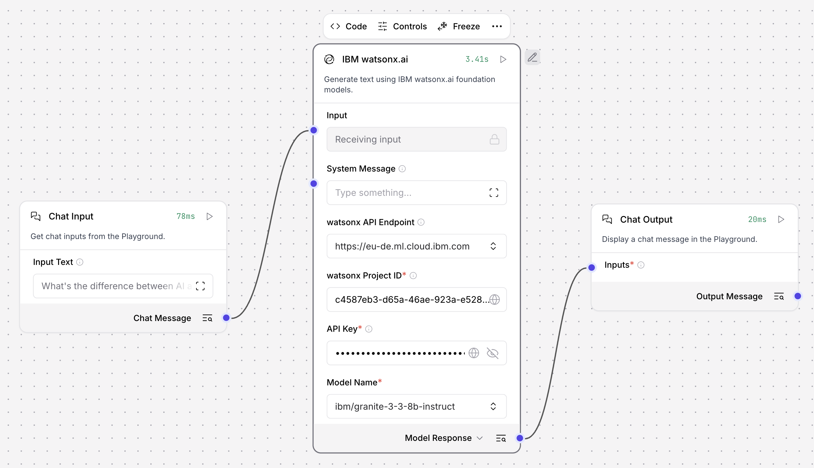

### 3. 🧠 Agentic AI with Langflow
**Goal:** Create an AI Agent that has access to a URL tool and a Calculator tool


#### Steps:
1. Reproduce the above flow (or load it from [./flows/basic-agentic-ai.json](./flows/basic-agentic-ai.json))
2. For watsonx.ai, ensure that the `API Endpoint`, `Project ID` and `API Key` have been set correctly. Also make sure the output is set to `Language Model`.
3. Ensure the model is set to a chat-capable model, such as `meta/meta-llama-3-3-70b-instruct`
4. When adding the `URL` and `Calculator` components to the canvas, select them and click `Tool mode`
5. Connect all the components

👏 Amazing! You just built your first AI Agent. Let's run it by clicking `▶️ Playground` and asking the question:

    What is 2x the value of a Euro in Dollars, using the latest most recent data

You'll get an answer stating a value of $2.34 or something (as of July 2025).

To see the magic behind, simply click the down arrow `🔽`. The Agent decided to use two tools:
1. The URL tool to fetch the current exchange rates
2. The Calculator tool to multiply the value by two

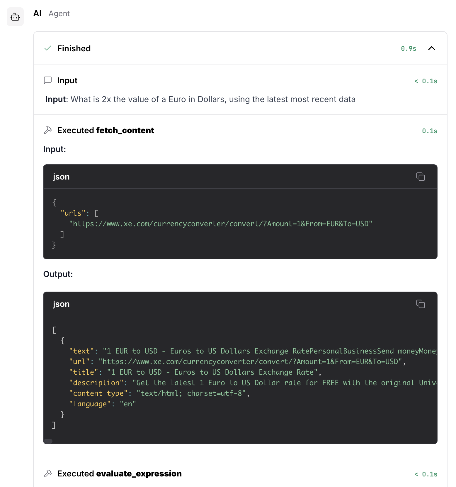

### 4. 📚 Retrieval-Augmented Generation (RAG) with Astra DB
**Goal:** Adding external knowledge by making use of Vector Search and RAG

#### Preparation: Creating a FAQ collection
In this step we'll create a new collection in your `support_agent` database in [Astra DB](https://astra.datastax.com) to store data as a knowledge base.

First we need to create a collection to store the data:
1. Browse to your `support_agent` database on [Astra DB](https://astra.datastax.com)
2. Click `Data Explorer` and click `Create Collection +`
3. Type your collection name, i.e. `company_faq` and enable `Vector-enabled collection`
4. Leave NVIDIA, NV-Embed-QA, 1024 and Cosine as it is
5. Click `Create Collection`


You just created a new empty collection to store knowledge base articles.

#### Steps: Add Astra DB as a RAG tool in Langflow

Extend your existing Basic Agentic AI flow with the following:
1. Collapse `Vector Stores` and drag `Astra DB` to the canvas
2. Click the component and select `Tool mode`
3. Make sure the `Astra DB Application Token` is configured, then select your `support_agent` database and `company_faq` collection
4. Click the config button behind `Actions` and update the three `Tool descriptions` by replacing
    - `Ingest and search documents in Astra DB` with
    - `Answer frequently asked questions (FAQs) about shipping, returns, placing orders, and more`
    - 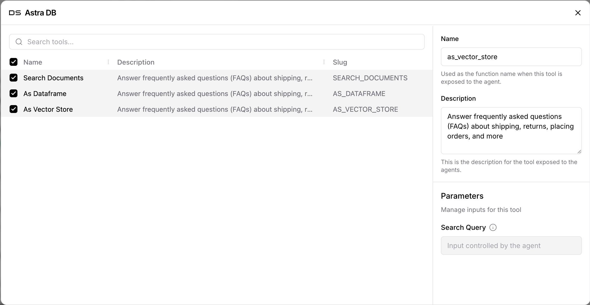
    - Click `Close x`
    - ⚠️ This essential step ensures the Agent understands to use this specific tool to search for FAQs
4. Connect the `Astra DB` component to the `Agent` component

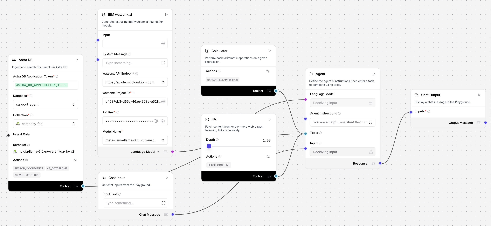  
For ease of use, this flow is also available here: [./flows/rag-agentic-ai.json](./flows/rag-agentic-ai.json).

Let's run it by clicking `▶️ Playground` and asking the question:

    What are your shipping times?

As a response we get a generic answer OR the agent just stops because of too many iterations. Why? Because our collection is still empty. Let's fix that!

#### Steps: Add some articles to our knowledge base
Extend your flow with the following additional flow (scroll down a bit for a blank piece of canvas):
1. Collapse `Data` and drag `File` to the canvas
2. Click on `Upload a file` and upload [./data/Company_FAQ.pdf](./data/Company_FAQ.pdf) from this repository (you'll have to download it first)
3. Collapse `Processing` and drag `Split Text` to the canvas
4. Set the `Chunk size` to 500 (because NV-Embed-QA only allows 512 tokens at maximum) and `Chunk overlap` to 100 (so that every chunk has a bit of information from the previous one)
5. Collapse `Vector Stores` and drag `Astra DB` to the canvas
6. Make sure the `Astra DB Application Token` is configured, then select your `support_agent` database and `company_faq` collection
7. Click the play button `▶️` on the `Astra DB` component, see the flow run and observe the time consumed. You can also click the intermediate magnifying glasses `🔍` to debug the flow.

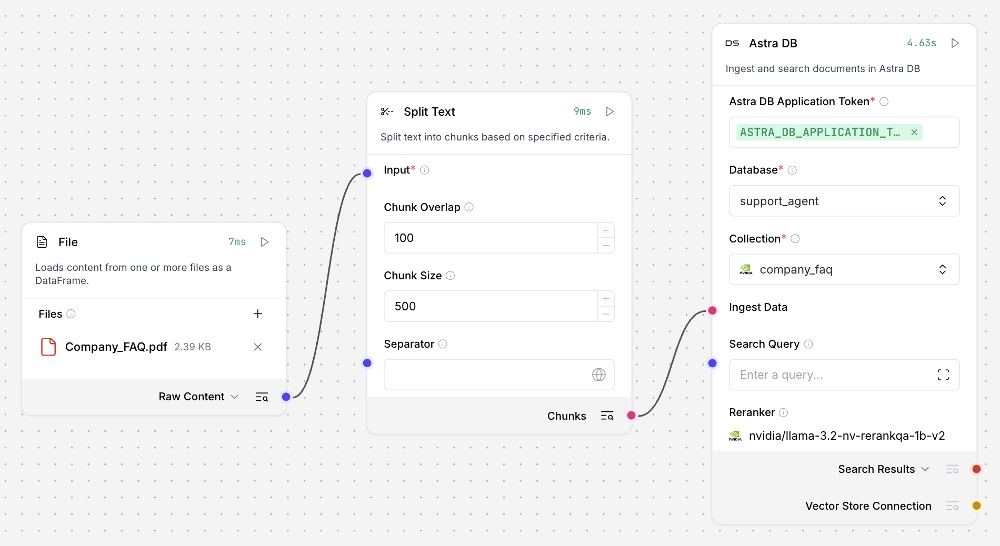

🙌 Congrats! You just loaded a PDF, converted it to plain text, chunked it and loaded it into a Vector enabled collection in Astra DB!

#### 👀 Check: Have a look at the data in Astra DB
In this step we'll have a look at the dataset in your `support_agent` database in [Astra DB](https://astra.datastax.com).

1. Browse to your `support_agent` database on [Astra DB](https://astra.datastax.com)
2. Click `Data Explorer` and click `company_faq`
3. Observe the data loaded into the collection on the right side of the screen
4. Toggle from `Table` to `JSON` view and collapse some of the rows to see what's inside

To see Vector Search in action, type the following in the text box `Search`:

    What are your shipping times

You'll see the chunk with shipping times show up as the first result. You just ran an Approximate Nearest Neighbor (ANN) search transparantly utilizing the Vectorize functionality in Astra DB that does the vectorization for you on demand.

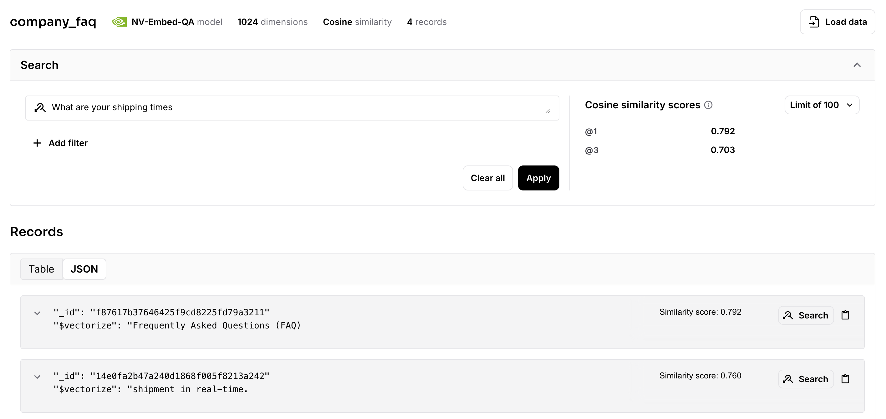

#### 🚀 Now let's run the Agent in Langflow
Browse back to Langflow, click on `▶️ Playground` and click on `+` on the left side to start a new Chat. Then run the following question:

    How many hours do I need to wait for a domestic order?

 🎉 You'll see the Agent making use of the Astra DB knowledge base to find relevant content and then running the calculator to calculate the amount of hours to wait.

 

### 5. 📈 Adding structured data
**Goal:** Every enterprise has structured data alongside unstructured data and often these are related to each other. This step enables your Agent to retrieve structured order and product details.

#### Preparation: Add Orders data
1. Browse to your `support_agent` database on [Astra DB](https://astra.datastax.com)
2. Click `Data Explorer` and click `Create Collection +`
3. Name the collection `orders`, disable the `Vector-enabled collection` switch and click `Create Collection`
4. Click `Load Data` and upload the file: [./data/sample_orders.csv](./sample_orders.csv)
5. Verify the data was loaded into Astra DB

#### Preparation: Add Products data
1. Click `Create Collection +`
2. Name the collection `products`, disable the `Vector-enabled collection` switch and click `Create Collection`
3. Click `Load Data` and upload the file: [./data/sample_products.csv](./sample_products.csv)
4. Verify the data was loaded into Astra DB

#### Steps 🛠️🔍: Add Order Lookup to the agent 
1. Return to your Langflow flow
2. Collapse `DataStax` and drag `Astra DB Tool` to the canvas
3. Configure as follows:
    - **Tool Name:** `OrderLookup`  
    - **Tool Description:** `A tool used to look up an order based on its ID`   
    - **Collection Name:** `orders`  
    - Ensure `Astra DB Application Token` and `API endpoint` are configured
    - Click `Open Table`, click `+` to add a field and update the field name to `orderNumber`, then click `Save` (this allows the tool to use the orderNumber column for queries)
4. Connect the `Astra DB Tool` component to the `Agent` component while selecting `Tool` as output mode.

#### Steps 🛠️🔍: Add Products Lookup to the agent 
1. Collapse `DataStax` and drag `Astra DB Tool` to the canvas
2. Configure as follows:
    - **Tool Name:** `ProductLookup`  
    - **Tool Description:** `A tool used to look up a product based on its ID`   
    - **Collection Name:** `products`  
    - Ensure `Astra DB Application Token` and `API endpoint` are configured
    - Click `Open Table`, click `+` to add a field and update the field name to `productId`, then click `Save` (this allows the tool to use the productId column for queries)
3. Connect the `Astra DB Tool` component to the `Agent` component while selecting `Tool` as output mode.

#### Steps 💬: Instruct the Agent
Let's provide our Agent a bit more information about what it's capable of doing and what guardrails to take into account. This enables more accuracy for our Customer Support Agent.

1. On the `Agent` component, click the square at `Agent Instructions`
2. Paste the following instruction:

```text
You are a skilled customer service agent supporting Customer Service Employees to answer questions from customers. Your primary responsibility is to use the available tools to accurately address user inquiries and provide detailed, helpful responses. You can:

- Look up order numbers to retrieve and share order details. Keep in mind that the date is the order date and that price is in USD.
- Access product information to provide relevant descriptions or specifications based on the retrieved product ids.
- Use the Astra DB knowledge base about Frequently Asked Questions on shipping, returns, placing orders, and more. Always use this tool to find relevant content!
- Use the Calculator tool to perform basic arithmetic. Only use the calculator tool!
- Use the URL tool to find known information on the internet or APIs to make the response more accurate.

Think step by step. If answering a question requires multiple tools, combine their outputs to deliver a comprehensive response.
Feel free to iterate a few times!
Example: For an inquiry about canceling an order, retrieve the order and product details, and also reference the FAQ for the cancellation policy.
Example: If there are questiona that require arithmetic, make sure to invoke the Calculator tool.
Example: If there is a need for external up-to-date information, make sure to invoke the URL tool.

Always aim to deliver clear, concise, and user-focused solutions to ensure the best possible experience.
```

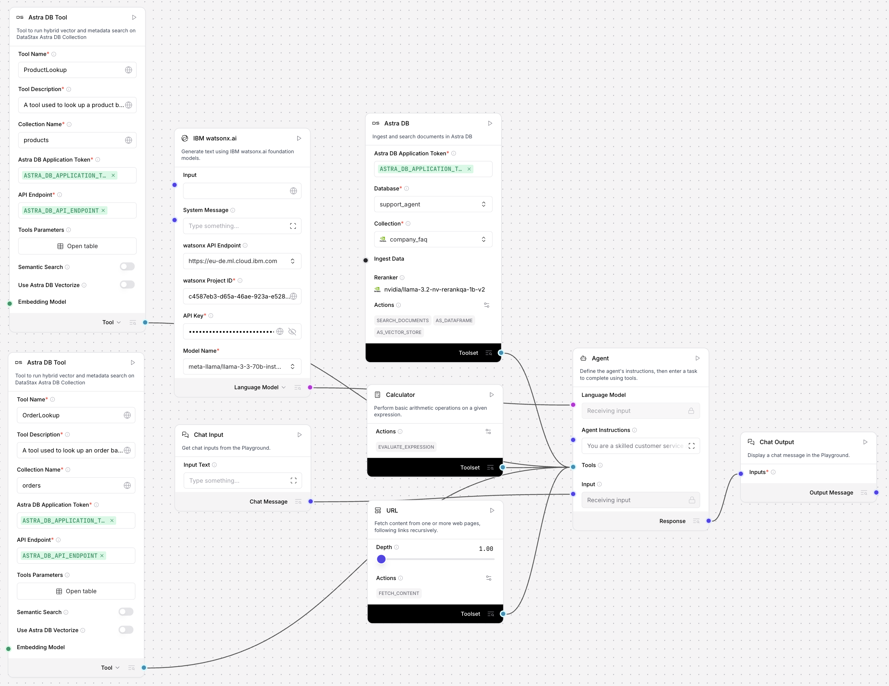  
For ease of use, this flow is also available here: [./flows/customer-support-agent.json](./flows/customer-support-agent.json).

🥳 You did it! You now have an Agentic Flow with access to:
- A company FAQ knowledgebase
- Orders data
- Product data
- A calculator
- Capability to fetch information from the internet

Let's run some queries. For instance:

- What's the shipping status of order 1001?
- What was ordered with 1003?
- What date will order 1004 arrive?
- How can I cancel order 1001 and what is the shipping policy?
- What's the amount of order 1005 in Euros?
- The customer paid 110 euros for order 1001, how much should we return?

Observe how all the different tools are being used to answer the user's questions.

### 5. 📱 Create an external app that call the Langflow REST Endpoint
In this step we'll create a simple Python app that runs the Langflow flow.

#### Steps: Use the Langflow API endpoint in Python
1. In Langflow exit the Playground and click on `Share` in the right top corner and then click `API Access`
2. Click on `Python`
3. Copy the code and paste it in a new file called `flow.py`
    - Change the `url` variable on line to 10 to `http://localhost:7860`, make sure to keep the full path (`/api/...`)!
    - Change the `input_value` variable on line 16 to something like '*How can I cancel order 1001 and what is the shipping policy?*'
5. Save the file
6. In the same API Access window in Langflow now click the `create and API key` link
7. In the new window, click `+ Add New`, type a description (e.g. Support Agent) and click `Generate API Key`
8. Make note of the generated API Key
    - ⚠️ This is the only time you'll see it, so make sure you save it somewhere handy!

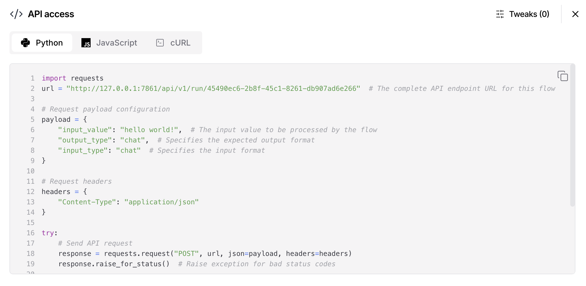

Let's run it!

```bash
export LANGFLOW_API_KEY=<your just generated API key>
uv run flow.py
```

As a response you'll see a JSON structure that contains the actual answer and additonal metadata.  
The answer you're probably looking for is located inside the JSONPath `$.outputs[0].outputs[0].results.message.text`.

If you change line 31 to the following, you'll see the actual response: `print(response.json()['outputs'][0]['outputs'][0]['results']['message']['text'])`

*(If you want to use watsonx.ai directly in your Python code, see the [watsonx.ai Python SDK documentation](https://ibm.github.io/watsonx-ai-python-sdk/). You can use the SDK to call the LLM endpoint with your API key, project ID, and prompt.)*

### 6. 🤩 Add a visual front-end
In this step we'll use a simple Streamlit app that supports Customer Support Agents.

⚠️ You need the Flow ID of your flow which can be found as the unique ID following `.../flow/` in the URL of Langflow while your Flow is open. Otherwise you can find it on line 10 in `flow.py`  following `.../run/`.

In order to run the app:
```bash
export LANGFLOW_FLOW_ID=<your flow id>
uv run streamlit run app.py
```

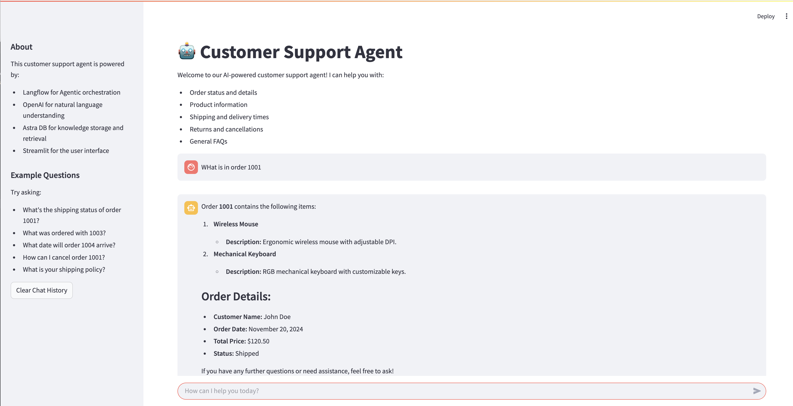
